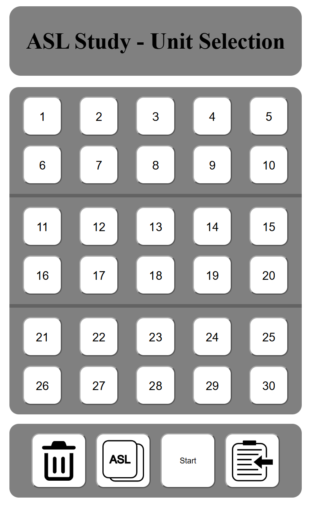
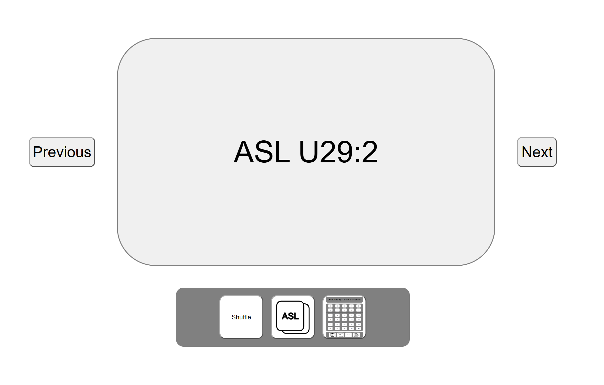

# ASL Study
ASL Study was created for Patrick Henry High School's ASL program. Our website is more streamlined compared to Quizlet, and has zero ads. Furthermore, we load the ASL videos in a way that does no cause the webpage to crash, allowing students to experience better performance and the ability to use this website on their Chromebooks.
This website is compatibly with computer and phone screens.

Please read the instructions below that explain how to use this website.

## Unit Selection Page

On the **Unit Selection** webpage, you can select which units you would like to study; there are initially no units selected.

### Buttons
| Clear | Flip Side | Start | Copy Link |
| :---: | :-------: | :----:| :-------: |
|  |  |  |  |
| Clears the selected units. | Flips which language the flashcard starts on. | Loads the flashcards to begin studying. | Copies the webpage link with the selected units to share. |

## Flashcard Page

The **Flashcard** webpage will have shuffled flashcards that belong to all of the units you selected on the **Unit Selection**/Home page. You can navigate back to the **Unit Selection** page by selecting the __Home__ button.

### Buttons
| Previous Card | Next Card | Shuffle | Flip Side | Home |
| :-----------: | :-------: | :------:| :-------: | :--: |
|  |  |  |  |  |
| Clears the selected units. | Flips which language the flashcard starts on. | Loads the flashcards to begin studying. | Copies the webpage link with the selected units to share. | Navigates back to the **Unit Selection** page |

---

### Created by the Computer Science 3-4 Class of 2027
Kaleb Fling

David Kostrinsky

Cooper Provins

Tina Hague

---

#### Our AI Policy
- LLMs cannot be given access to anyone's personal information.
	- Hide personal information and API Keys.
- No code generation, but debugging and documentation are allowed.
	- Writing comments/documentation with AI is allowed.
	- Preferred prompts include “Lead me to the solution but limit generated code”

